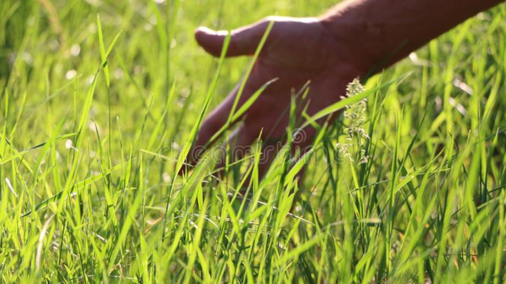

## Grass Touchers Corp. (GTC)

We here at Grass Touchers Corp. are a group of highly determined, yet lowly experienced software engineers. We come from a very computer science heavy background yet this will not stop us from becoming the next Google or Amazon. While me mainly spend our time looking at computer screens, we  like to challenge ourselves and move forward no matter what obstacle. We all generally get about 1 hour of daylight per day and keep external communications to a low. However, and nevertheless, if you would like to contact us, please feel free to. Our individual contact information is bellow.

# Contact Information:
| Name | Email | Phone | Major |
|---|---|---|---|
| Jonathan Hsu | jihsu@ucsd.edu | 858-888-0088 | CS |
| Guan Li | gcl001@ucsd.edu | 858-218-4637 | CS |
| Steven Khaw | skhaw@ucsd.edu | 626-825-5186 | Math-CS |
| Yuelin Dai | y1dai@ucsd.edu | 858-250-9875 | CS |
| Younus Ahmad | yahmad@ucsd.edu | 559-691-7990 | CE |
| Steven Chin | sdchin@ucsd.edu | 323-810-6037 | Math-CS |

###### We are net held responsable for any information lost, any miss-use of our software, and anything of importance to be deleted. Use our software at your own risk. <3
