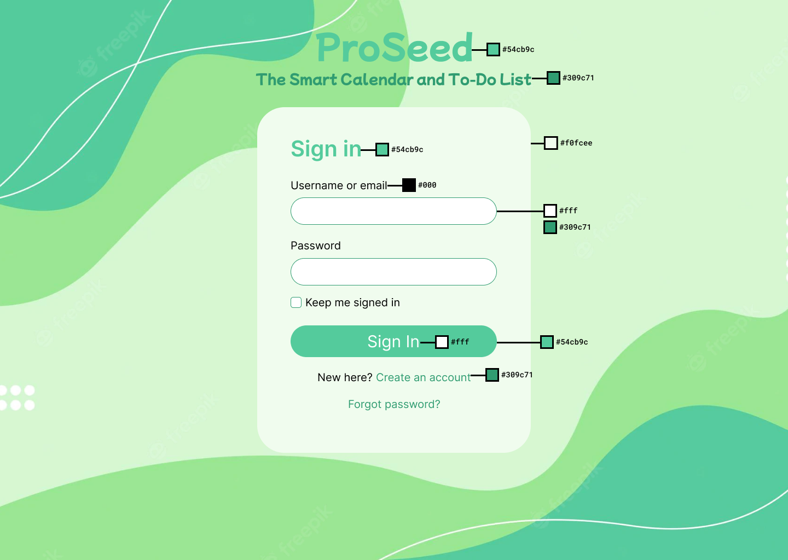

# ProSeed CSS Specification
Link to high fidelity prototype: [Figma](https://www.figma.com/proto/vJAL9jNYD1M3XEjxaxH0cd/ProSeed-Prototype?page-id=0%3A1&node-id=3%3A3&viewport=623%2C-370%2C1.79&scaling=scale-down&starting-point-node-id=3%3A3)

Not every page from the prototype is included in this specification. There are broadly three main divisions (sign in, middleground, calendar), and pages within the same division can be assumed to have the same color scheme unless otherwise specified in this document.
## Color Scheme

 `#54cb9c` 60% = `rgba(84, 203, 156, 0.6)`

 `#309c71` 60% = `rgba(48, 156, 113, 0.6)`

 `#36b080` 60% = `rgba(54, 176, 128, 0.6)`

 `#c2dbbd`

 `#f0fcee` 60% = `rgba(240, 252, 238, 0.6)`

 `#fff` 60% = `rgba(255, 255, 255, 0.6)`

 `#000` 60% = `rgba(0, 0, 0, 0.6)`

 `#9c3030`

 `#d57676`

 `#30349c`

 `#767ad5`

## Branding

## Sign In Pages
### Splash Image

### Sign in

## Middleground
### Main page

### Delete pages
#### Delete page 1

#### Delete page 2

