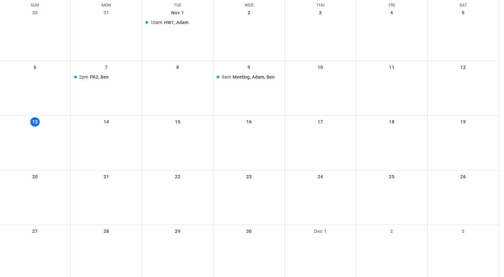

# A Brief Explanation About The Template
Recommend reading together with the UML Diagram ([link](https://miro.com/app/board/uXjVPGeeU_g=/))
## Format
One json file is enough for importing/exporting the calendar. The file consists of: one array of user data of all collaborators, one array of all events on the calendar, and one array of all tasks in the todo-list. The format derives from the UML diagram and looks like following: 
- The array `users` in each entry of `eventsList` and `tasksList` contains indices (in `usersList`) of an event/task's related users 
```json
{
    "usersList" : [
        {
            "firstname" : " ",
            "lastname" : " ",
            "username" : " ",
            "password" : " ",
            "profileID" : " ",
            "calendarIDs" : {
                "key" : " ",
                "v" : true
            }
        }
    ],
    "eventsList" : [
        {
            "startDay" : "MM/DD/YY HH:MM",
            "endDay" : "MM/DD/YY HH:MM",
            "name" : " ",
            "location" : " ",
            "description" : " ",
            "users" : [0]
        }
    ],
    "tasksList" : [
        {
            "name" : " ",
            "tag" : " ",
            "createdDate" : "MM/DD/YY HH:MM",
            "taskLastUpdated" : "MM/DD/YY HH:MM",
            "workDates" : "MM/DD/YY HH:MM",
            "dueDate" : "MM/DD/YY HH:MM",
            "taskDescription" : " ",
            "users" : [0]
        }
    ]
}
```
## Importing
Importing a calendar consists of 5 steps:
1. Extract `usersList`, `eventsList` and store them locally
2. Verify signed-in user's credential
    - If none of the user in `usersList` matches signed-in user, stop importing
3. Initialize an empty calendar
4. For each event in `eventsList`:
    - Read `startDay` and `endDay` to get related date(s)
    - Insert the event's index (in `eventsList`) to its start day's corresponding entry in the calendar
    *(If the event spans more than one day, insert the event's index to all impacted days)*
3. For each task in `tasksList`:
    - Read `dueDate` to get related date
    - Insert the task to its due day's corresponding entry in the calendar
    - Insert the task to todo-list
## Exporting
Exporting the active calendar consists of 4 steps:
1. Save the array of users as `usersList`
2. Save the array of active events as `eventsList`
3. Save the array of tasks in todo-list as `tasksList`
3. Export json containing `usersList`, `eventsList` and `tasksList`
## Example
```json
{
    "usersList" : [
        {
            "firstname" : "Adam", 
            ....
        },
        {
            "firstname" : "Ben", 
            ....
        }
    ],
    "eventsList" : [
        {
            "startDay" : "11/01/22 10:00",
            "endDay" : "11/01/22 11:00",
            "name" : "HW1",
            "users" : [0],
            ...
        },
        {
            "startDay" : "11/07/22 14:00",
            "endDay" : "11/07/22 15:00",
            "name" : "PA2",
            "users" : [1],
            ...
        },
        {
            "startDay" : "11/09/22 9:00",
            "endDay" : "11/09/22 10:00",
            "name" : "Meeting",
            "users" : [0, 1],
            ...
        }
    ],
    "tasksList" : []
}
```
After importing the above json, the calendar will be structured like following:


